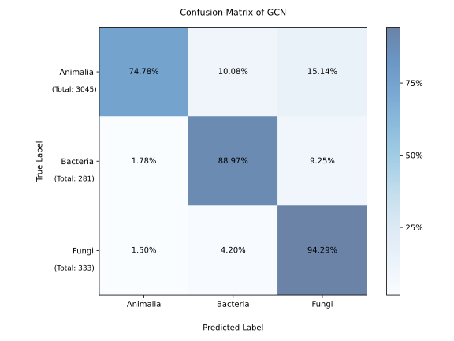

# MNP-Taxonomy-Classifier

This repository contains the code, datasets, trained models, and analysis scripts for the paper:  

**"xxxxxx"**  

Our goal is to build machine learning models (GCN, SVM, XGBoost) to classify the biological origins (**Animalia, Bacteria, Fungi**) of natural products, detect errors in datasets' labels, and to provide **chemical interpretability analysis** for model decisions.  

---

## Repository Structure

```
MNP-Taxonomy-Classifier/
│
├── data/                  # Raw and processed datasets
│   ├── raw/               # Original CMNPD / NPAtlas data (.tsv / .sdf)
│   └── processed/         # Preprocessed CSV files for training & testing
│
├── results/               
│   ├── models/            # Trained models (GCN .ckpt, SVM/XGB .pkl)
│   ├── predictions/       # Prediction results and rationales
│   └── figures/           # Visualization (scaffold, confusion matrices, t-SNE, etc.)
│
├── src/                   # Source code
│   ├── interpretability/  # Scaffold and rationale analysis (Murcko, MCTS, NPClassifier)
│   └── error_data_detection_and_cleaning/  
│                          # Error detection, noise cleaning, cross-validation
│
└── README.md              # Project documentation
```

---

## Installation

We recommend using **Python 3.11** with `conda`:

```bash
conda create -n mnp python=3.11
conda activate mnp
```

Install dependencies:

```bash
pip install -r requirements.txt
```

---

## Training

To train a model from processed datasets using chemprop:

```bash
cd ./src/train
./train_chemprop.sh
```

Key arguments:
- `--data-path`: training CSV (e.g., `../data/processed/data_cmnpd_after2000.csv`)
- `--output-dir`: output directory for checkpoints and logs

We also provide **cross-training scripts** (`cross_training.py`) to evaluate repeat splits (`n=3, 5, 10`) and study label noise.

---

## Prediction

To generate predictions on a test set:

```bash
cd src
./predict_chemprop.sh ../data/processed/CMNPD2.0_test_set_smiles.csv \
                      ../results/predictions/CMNPD2.0_test_set_predict.csv \
                      ../results/models/model_GCN_cleaned_finetuned.ckpt
```

Predictions for all models (GCN / SVM / XGB) on the **final test set** are available in:

```
results/predictions/final_testset/
```

---

## Interpretability

We implemented multiple interpretability approaches:

- **Murcko Scaffolds**: frequent scaffolds per origin  
- **NPClassifier**: comparison with curated ontology labels ([NPClassifier](https://pubs.acs.org/doi/10.1021/acs.jnatprod.1c00399))  
- **Monte Carlo Tree Search (MCTS)**: exploring rationales using Chemprop’s interpret module  
- **Rationale Visualization**: atom- and substructure-level highlighting of important features  

Scripts and notebooks are located in:

```
src/interpretability/
```

---

## Error Detection & Cleaning

Noise detection is performed via:

- Cross-training with multiple repeats (3 / 5 / 10)  
- Collecting consistently misclassified samples  
- Similarity-based literature verification (Morgan fingerprints + Tanimoto search)  

Relevant code is in:

```
src/error_data_detection_and_cleaning/
```

---

## Results

- **Models**: stored in `results/models/`
- **Predictions**: stored in `results/predictions/`
- **Figures**: scaffold overlaps, confusion matrices, t-SNE visualizations (`results/figures/`)

Example confusion matrix (GCN on CMNPD2.0 test set):

<p align="center">
  
</p>

---

## Data Sources

- **CMNPD**: [https://www.cmnpd.org/](https://www.cmnpd.org/)  
- **NPAtlas**: [https://www.npatlas.org/](https://www.npatlas.org/)  
- **Test set**: from our group’s CMNPD2.0 update (not yet public), formatted consistently with training data.  

⚠️ Note: To reproduce cheminformatics analyses (e.g., scaffold overlap, SOM analysis), please also download the **full CMNPD dataset with per-species SDF files** (`animalia.sdf`, `bacteria.sdf`, `fungi.sdf`).  

---

## Citation

If you use this code or dataset, please cite our paper:

```
@article{xx,
  title   = {xx},
  author  = {xx et al.},
  journal = {Journal xx},
  year    = {2025}
}
```
